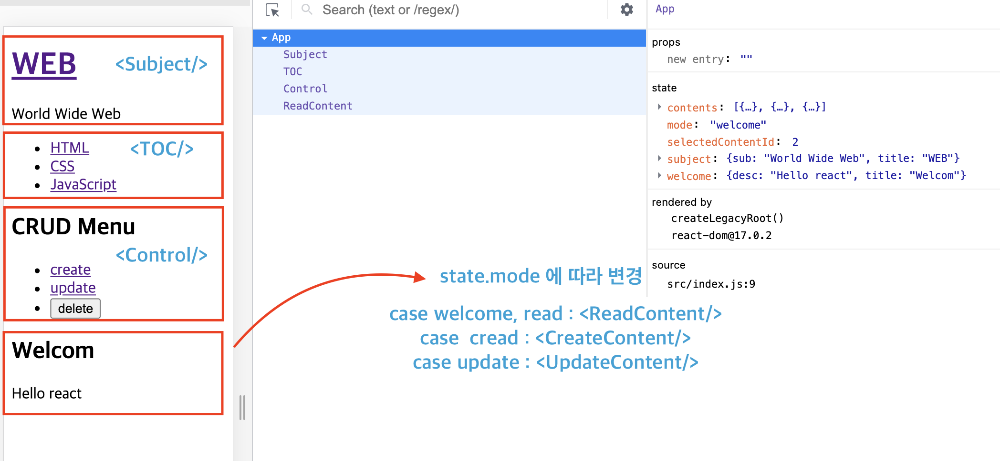
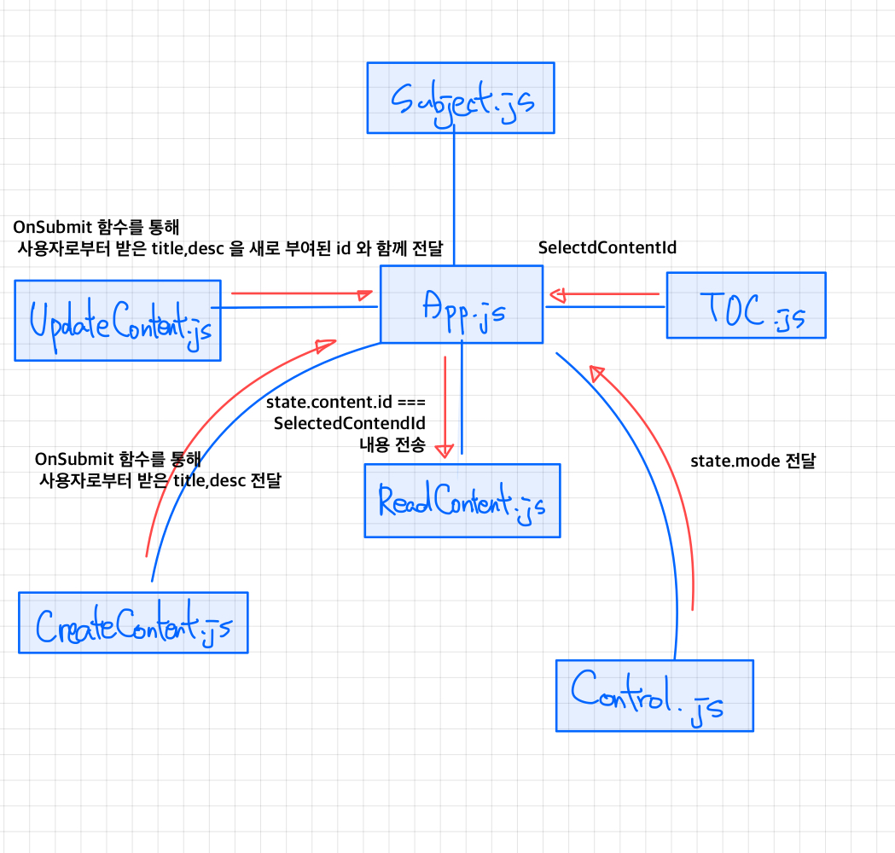

# Implement React CRUD System

> React 로 간단한 Create, Read, Update, Delete 시스템을 직접 구현해 본다.

# Ⅰ. Implementation

## 1. FlowChart




## 2. Component

- Subject.js

  - 상호작용 : WEB 클릭 시 state.mode 가 welcome 으로 변경

  > `App.js` 는 `title, sub, onChagePage` props 를 `Subject.js` 로 보내준다.

  > 서로간의 Event 의 경우 `App.js` 에서 `onChangePage` 라는 function 을 props 로`Subject.js` 에게 보내주고, Subject.js 는 onChangePage 함수를 `onClick` 내에서처리한다.  
  > 이유 1: **실제 Client 는 Subject.js 와 소통**  
  > 이유 2: **state.mode는 App.js 에서 선언하여 setState는 App.js 에서 가능**

  ```jsx
  // App.js 일부
  <Subject
    title={state.subject.title}
    sub={state.subject.sub}
    onChangePage={function () {
      this.setState({ mode: 'welcome' });
    }.bind(this)}
  />
  ```

  ```jsx
  // Subject.js 일부
  <a
    href="/"
    onClick={function (e) {
      e.preventDefault();
      this.props.onChangePage();
    }.bind(this)}
  >
    {this.props.title}
  </a>
  ```

- TOC.js

  - 상호작용 : 각 목차 클릭 시 `<ReadContent/>` 에 해당 목차에 해당하는 Title 과 Description 출력

  > TOC 에서 눌러진 내용을 확인 하고, TOC 에서 눌러진 요소의 id 값(`selectedContentId`)을 ReadContent 에게 전달 해야 한다.

  ```jsx
  // App.js TOC 부분
  <TOC
    onChangePage={function (id) {
      this.setState({
        mode: 'read',
        selectedContentId: Number(id),
      });
    }.bind(this)}
    data={state.contents}
  />
  ```

  **TOC.js** 는 그냥 `data`라는 `props` 를 전달받아 list 로 출력하는 역할이므로 코드 생략

- ReadContent.js

  - 상호작용 : TOC.js 와 Subject.js 에서 눌러진 요소에 대한 `title` 과 `desc` 를 출력한다.

  ```javascript
  // App.js ReadContent 부분
  getReadContent() {
    const targetContent = this.state.contents.filter((content) => {
      return content.id === this.state.selectedContentId;
    });
    return targetContent[0];

  getContent() {
    case 'read':
      _article = <ReadContent title={_content.title} desc={_content.desc} />;
      break;
    }
  return _article;
  }
  ```

- Control.js
  //TODO: 여기서 부터 다시 작성.
- CreateContent.js
- UpdateContent.js

## 3. Functions

| Where? | name               | desc                                                                       |
| ------ | ------------------ | -------------------------------------------------------------------------- |
| App.js | `getReadContent()` | 사용자가 **마지막으로 선택한** `Contents` 에 대한 `data` 를 `return` 한다. |
| App.js | `getContent()`     | state변수 `mode` 에 따라 각기 다른 `_article` 을 `return` 한다.            |

getContent 에서 return 하는 \_article 예시

```jsx
_article = <ReadContent title={_title} desc={_desc} />;
```

## 4. State 변수

**App.js**  
|name|type|default|desc|
|-|-|-|-|
|mode|`String`|welcome|welcome, read, create, update 4가지로 이루어 져있다.|
|selectedContentId|`Number`||사용자가 마지막에 선택한 contents의 id 값 저장|
|welcome|`Object`|welcome Message|welcome 메세지 출력|
|contents|`Object`||contents 의 id , tilte, desc, url 정보가 담겨있다.|

# Ⅱ. What I learned

기본 동작인 react CRUD 동작원리에 대해 공부하면서 배운점

[NOTE 📝](https://hypnotic-stone-d7f.notion.site/React-efa364157ac14e81a19019d0a3ccb5cf){:target="\_blank"}

1. Component 를 만드는 법
2. State 다루기  
   react는 `Component` 를 **외부**에서 조작할 때는 `props` 를, **내부적**으로 상태를 관리할 때는 `state` 를 사용하더라.
3. State & Props
   **사용자**의 입장에서 조작하는 장치는 `Props` 이고,
   `Props` 를 자식에게 받아와 **내부적으로 조작**을 하는건 `State` 이다.
4. Component, State, Props 를 가지고 기본적인 CRUD 구현

# Ⅲ. Retrospective

## 왜 배울까?

항상 무언가를 시작할 때 왜 배우는가를 생각하고 배우려 하는 편이다. 목적 있는 공부는 내가 어떤것에 집중을 해야 하는지 도와주기 때문이다.

특히,
React를 시작하기 전에는 전에 다니던 회사에서 잘 쓰고있는 언어만을 가지고도 충분히 개발이 가능했기 때문이다. (하지만, 대부분 퍼블리싱작업만 해왔다.)

그러다, 퇴사 후 Wecode Bootcamp에 참여하기위해서, 요즘 핫한 프레임워크 라고 해서 시작한 React 공부이다.  
모든 프레임워크, 언어는 각자 생겨난 이유가 있고, 잘 맞는 사용처가 따로 있다.

### React 라는 언어는 무슨 장점이?

**블록조립식** : React 는 HTML을 레고블록 처럼 조립식으로 Component 라는 것을 이용해 쌓아 올린다.  
**One shot, Multi Kill** : 일반 웹사이트를 만드는 것 보다 비즈니스적 강점이 있다. (React Native 를 사용해 App을 만들 수 있기 떄문)  
**Virtual DOM** : Virtual DOM 이 바뀐 부분만 새로 데이털르 로드해주어서 효율적인 DOM 제어가 가능하다고는 하는데, 아직까지는 이거에 대해선 깊게는 모르겠다.

즉, 편하고, 관리하기쉽고, 비즈니스적 강점이 있고, 데이터로드가 작아서 트래픽도 적다!! 는 장점이 있다.

## 직접 만져보며

확실히 Component로 쪼개서 관리하는건 편하다고 느꼈다.  
state, props 의 관계를 통해 소통하는 것도 좋은 것 같다.  
하지만, 아직 이벤트에 대해서는 조금 애매한 감이 있다. 부모에게 자식에게 전달하는 함수prop 을 생성하고, 자식이 받아서 사용해서 다시 부모에게 전달하는데, 이부분은 다시 노트정리가 필요해보인다.

## 아쉬운점

1. styleSheet 관리 방법
2. 유지보수가 좋은 Component 생성 방법
3. this.state, this.setState를 쓰기위한 bind(this)의 남발

유지보수가 쉽다면, 그에대해 CSS style 관리방법이 있을텐데 아직 그부분에 대해서는 모르겠다.  
그리고, 유지보수를 위해 좋은 코드를 짜는 방법이 분명 있을텐데 아직 걸음마 단계라 그저 배우는데 급급했던 점이 아쉽다.  
또, 굉장히 this 를 많이 쓰는데 arrow function 을 사용하면 this 를 쓸 수없고 일반 function 문을 사용하면 코드 가독이 안좋아진다. 분명 더 좋은 방법이 있을텐데...

### -- End Of Doc. --
